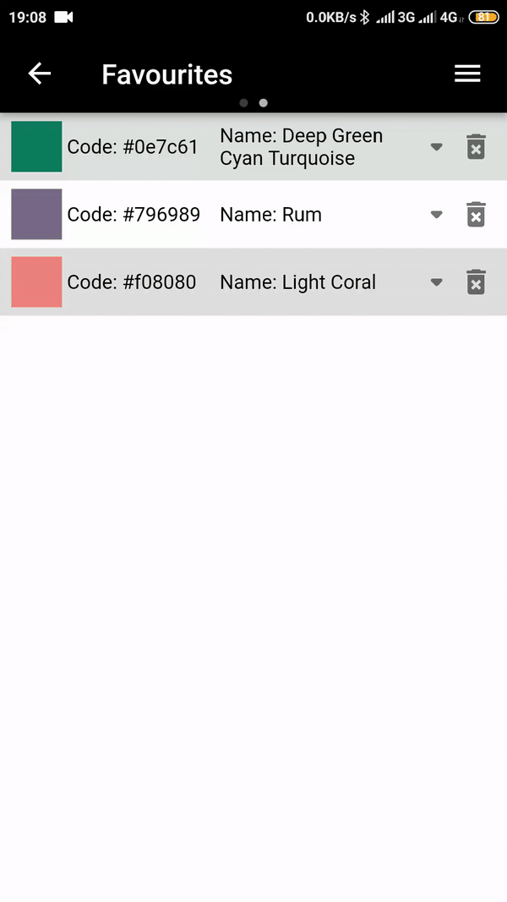

# Color Picker

## App Demo

| Color picking process: | Altering color: | 
| --- | --- |
|  |  |
## General Information

Color picker allows you to know the code and the name of a color by pointing your phone's camera on
it.

It also can save to favourites a color from this[^1] table that is closest to picked one.
[^1]: https://raw.githubusercontent.com/jonathantneal/color-names/master/color-names.json

### - Project uses Clean Architecture approach
### - Project uses Cubit for navigation purposes

## Features:

- Supports both iOS and Android
  > On iPhone 6-8 app uses low camera resolution to avoid memory shortage (
  flutter [issue #44436](https://github.com/flutter/flutter/issues/44436))
- Supports English and Russian localisations
- Identifies observed color's code in real-time
- Tapping the bottom panel saves color to favourites list
- Favourites list is automatically saved to device's memory
  > Saved file can be found at "\*app_documents_directory\*/favouriteColors.json"
- Crosshair is always visible due to using of inverted colors
- Toast-notifications use picked color as background color and it's inversion for text color
- Saved color can be altered and copied to clipboard
  > You can copy color as values for four most popular color models (RGB, CMYK, LAB(daylight), HSV(HSB))

## Flutter Plugins Used[^2]:

[^2]: Plugins' versions can be found
at "[this](pubspec.yaml)"

- auto_size_text
- wakelock
- fluttertoast
- path_provider
- device_info_plus
- http
- camera
- equatable
- flutter_bloc